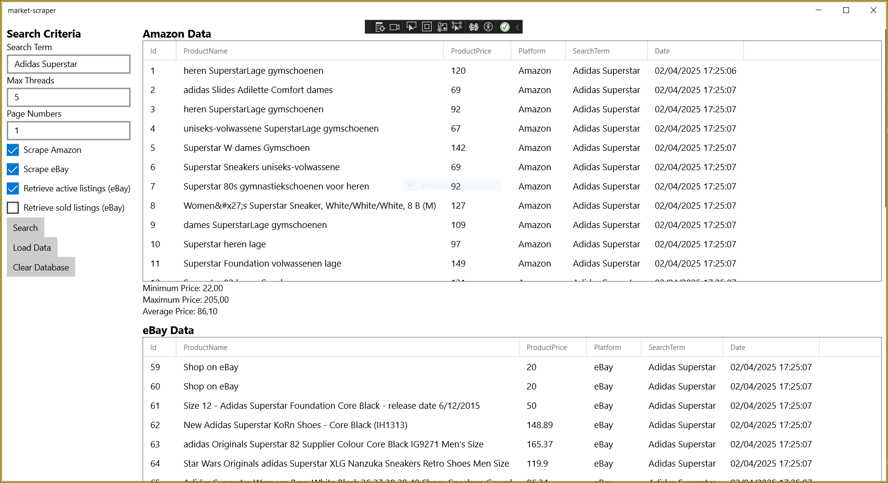
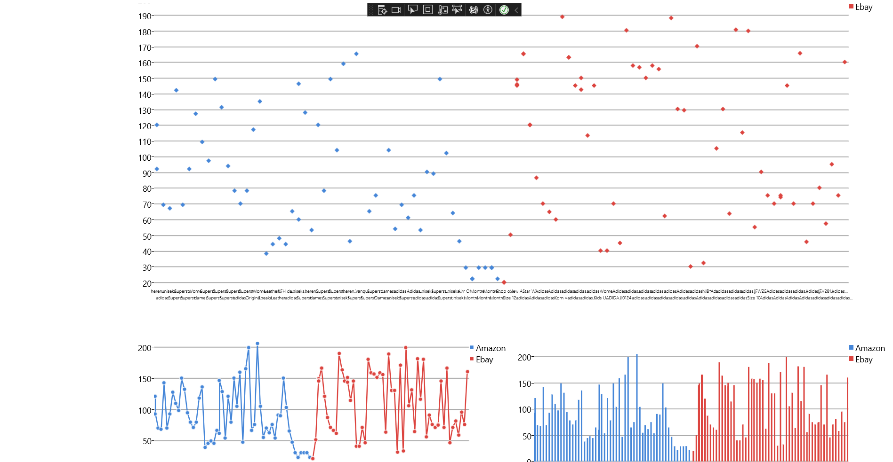

# 🧠 Market Price Scraper

A multi-threaded UWP desktop application that scrapes product data from **Amazon** and **eBay**, storing it in a local SQLite database and visualizing historical pricing using interactive charts.

This was built to explore **concurrent scraping**, **lightweight persistence**, and **data-driven UI components** — combining front-end and back-end logic
.

---

## 🚀 Features

- 🔍 Scrapes Amazon and eBay listings for live product pricing  
- ⚙️ Uses `SemaphoreSlim` to manage concurrent scraping threads per platform  
- 📊 Displays price data using charts (scatter, line, and column)  
- 💾 Persists all data locally via SQLite  
- 🧹 Can clear database on demand or reprocess past queries  
- 🧠 UI built using **UWP**, with filtering options and multi-platform scraping toggles

---

## 🧩 Tech Stack

- **C#** (.NET / UWP)
- **SQLite** via `Microsoft.Data.Sqlite`
- **HtmlAgilityPack** + `Fizzler` for HTML parsing
- **Concurrency**: `SemaphoreSlim`, `async/await`
- **Data visualization**: WinRT XAML Toolkit

---

## 🖥️ How to Run

1. Clone the repo:
   ```bash
   git clone https://github.com/TheRealTimo/Threading.cs.
Open `market-scraper.sln` in Visual Studio 2022 (or newer)
Build & run the `market-scraper` UWP project.
Use the GUI to:
* Select platforms (Amazon/eBay)
* Configure search term, page count, and max threads
* Launch scraping and explore results in real-time


## 📷 SCRRNSHOTS 




## 📁 Project Status
This was a past learning project and is no longer actively maintained. The goal was to prototype a lightweight data pipeline, combining scraping, storage, and visualization into a cohesive desktop app.